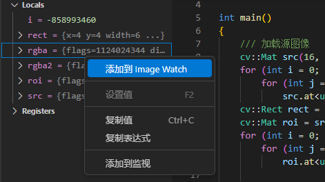

# 适用于 Visual Studio Code 的 Image Watch 扩展

Image Watch 是一个 Visual Studio Code 调试器"图像监视"窗口，用于在调试本机 C++ 代码时查看内存中的位图。

参考了[Image Watch for Visual Studio](https://learn.microsoft.com/en-us/previous-versions/visualstudio/visual-studio-2015/debugger/image-watch/image-watch?view=vs-2015) 的外观和功能。

## Features

内置了对 OpenCV 图像类型（cv::Mat）的支持

## Known Issues

- 目前仅支持 OpenCV 图像类型（cv::Mat），其他图像类型可能无法正确显示。
- 可能会有性能问题，特别是在处理大图像时。
- 获取局部变量尚未实现。
- 目前仅支持 C++ 调试器。
- 添加到监视的图像不会在断点处自动更新。
- 监视窗口中的图像不会在调试会话结束后清空。
- 监视窗口中的图像无法删除。

## Release Notes

### 0.0.1

一个基本的实现，支持 OpenCV 图像类型（cv::Mat）。

---

## Requirements

This extension requires Visual Studio Code version 1.100.0 or higher.
