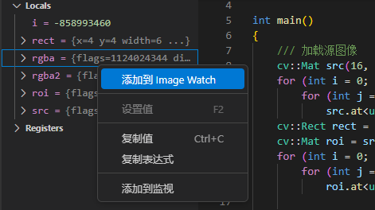
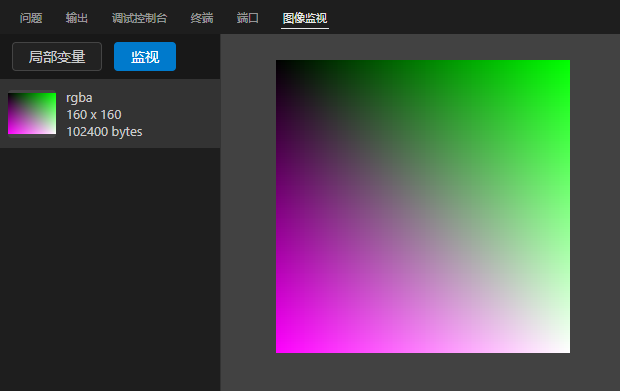

# 适用于 Visual Studio Code 的 Image Watch 扩展

Image Watch 是一个 Visual Studio Code 调试器"图像监视"窗口，用于在调试本机 C/C++ 代码时查看内存中的位图。

参考了[Image Watch for Visual Studio](https://learn.microsoft.com/en-us/previous-versions/visualstudio/visual-studio-2015/debugger/image-watch/image-watch?view=vs-2015) 的外观和功能。

## Features

- 内置对 OpenCV `cv::Mat` 的支持
- **断点命中时自动枚举**当前作用域内所有图像类型的局部变量
- **断点命中时自动刷新**手动添加到监视列表的图像变量
- 调试会话结束后自动清空
- 支持缩放、拖拽、像素网格、像素值文本显示、状态栏坐标/值查看
- 右键菜单：归一化、伪彩色、忽略 Alpha、复制像素地址/值
- **可扩展的自定义图像格式**：通过 `settings.json` 配置即可支持任意 C/C++ 图像结构体




## Custom Formats

除了内置的 `cv::Mat` 支持外，你可以通过 VS Code 设置添加任意自定义图像结构体格式。

在 `settings.json` 中添加 `imageWatch.customFormats` 数组，每个条目是一个**格式描述符**，告诉扩展如何从你的结构体成员中提取图像的行、列、通道、深度、数据指针和步长。

### 描述符字段说明

| 字段 | 类型 | 说明 |
|------|------|------|
| `name` | string | 格式名称（仅用于日志展示） |
| `typePattern` | string | 正则表达式，匹配调试器中显示的变量类型名 |
| `members` | string[] | 结构体成员名列表，顺序必须与调试器展开顺序一致 |
| `mapping` | object | 字段映射规则（详见下方） |
| `memorySize` | string | 内存大小算术表达式，如 `"rows * step"` |

### mapping 字段映射

| 映射项 | 简单写法 | 高级写法 |
|--------|---------|---------|
| `rows` | `"height"` — 直接指定成员名 | — |
| `cols` | `"width"` — 直接指定成员名 | — |
| `channels` | `"channels"` — 直接成员名 | `{"value": 3}` 固定值；`{"fromFlags": "flags", "shift": 3, "mask": 63, "offset": 1}` 从位域提取 |
| `depth` | `"depth"` — 值为 OpenCV depth 枚举(0-6) | `{"field": "depth", "interpret": "byteSize"}` 按字节大小(1/2/4/8)映射；`{"field": "fmt", "map": {"0": 0, "1": 5}}` 自定义映射表；`{"value": 0}` 固定值 |
| `data` | `"data"` — 数据指针成员名 | — |
| `step` | `"step"` — 行步长(字节)成员名 | `{"field": "step", "interpret": "opencvStep"}` 解析 OpenCV 的复杂 step 对象 |

### depth 映射模式

- **`"opencv"`**：值直接是 OpenCV depth 枚举 — `0`=CV_8U, `1`=CV_8S, `2`=CV_16U, `3`=CV_16S, `4`=CV_32S, `5`=CV_32F, `6`=CV_64F
- **`"byteSize"`**：值是每个元素的字节数 — `1`→CV_8U, `2`→CV_16U, `4`→CV_32F, `8`→CV_64F
- **`"byteSizeInt"`**：同 byteSize，但 4 字节映射到 CV_32S（整数）而非 CV_32F（浮点）
- **自定义映射表**：`{"field": "fmt", "map": {"0": 0, "1": 2, "2": 5}}` — 键是字段值的字符串，值是 OpenCV depth

### memorySize 表达式

支持简单算术表达式，可引用以下变量：

- `rows`, `cols`, `channels`, `step` — 从 mapping 解析出的值
- `datastart`, `dataend` — 如果结构体有这些成员，会自动提取其地址值
- `depth` — OpenCV depth 枚举值

示例：`"rows * step"`, `"dataend - datastart"`, `"rows * cols * channels * 4"`

---

### 示例 1：mat_ref（自定义轻量图像引用）

C/C++ 结构体：

```cpp
struct mat_ref {
    int rows;       // 图像高度
    int cols;       // 图像宽度
    int channels;   // 通道数
    int depth;      // 每元素字节数 (1, 2, 4, 8)
    void* data;     // 数据指针
    size_t step;    // 行步长（字节）
};
```

settings.json 配置：

```json
{
    "imageWatch.customFormats": [
        {
            "name": "mat_ref",
            "typePattern": "\\bmat_ref\\b|\\brow_ref\\b",
            "members": ["rows", "cols", "channels", "depth", "data", "step"],
            "mapping": {
                "rows": "rows",
                "cols": "cols",
                "channels": "channels",
                "depth": { "field": "depth", "interpret": "byteSize" },
                "data": "data",
                "step": "step"
            },
            "memorySize": "rows * step"
        }
    ]
}
```

### 示例 2：stb_image 风格缓冲区

C/C++ 结构体：

```cpp
struct ImageBuffer {
    int width;
    int height;
    int channels;
    unsigned char* pixels;
};
```

settings.json 配置（无 step 字段，连续存储）：

```json
{
    "imageWatch.customFormats": [
        {
            "name": "ImageBuffer",
            "typePattern": "\\bImageBuffer\\b",
            "members": ["width", "height", "channels", "pixels"],
            "mapping": {
                "rows": "height",
                "cols": "width",
                "channels": "channels",
                "depth": { "value": 0 },
                "data": "pixels",
                "step": "width"
            },
            "memorySize": "height * width * channels"
        }
    ]
}
```

> 注意：此示例中 step 设为 `"width"` 是因为 `width` 成员的值恰好等于 `width * channels * 1`（8位单字节）时步长等于宽度像素数乘以通道。如果实际 step != width*channels，需要调整。对于无 padding 的连续存储，也可以把 step 直接写成成员名并在结构体里加一个 step 字段。

### 示例 3：带 format 枚举的纹理数据

C/C++ 结构体：

```cpp
enum PixelFormat { FMT_GRAY = 0, FMT_RGB = 1, FMT_RGBA = 2 };

struct TextureData {
    int w;
    int h;
    PixelFormat fmt;
    int pitch;      // 行步长（字节）
    void* ptr;
};
```

settings.json 配置：

```json
{
    "imageWatch.customFormats": [
        {
            "name": "TextureData",
            "typePattern": "\\bTextureData\\b",
            "members": ["w", "h", "fmt", "pitch", "ptr"],
            "mapping": {
                "rows": "h",
                "cols": "w",
                "channels": { "field": "fmt", "map": { "0": 1, "1": 3, "2": 4 } },
                "depth": { "value": 0 },
                "data": "ptr",
                "step": "pitch"
            },
            "memorySize": "rows * step"
        }
    ]
}
```

## Requirements

- Visual Studio Code 1.84.0 或更高版本
- C/C++ 调试器（cppvsdbg 或 cppdbg）

## Known Issues

- 自动枚举依赖变量的 `type` 字段进行快速过滤，如果调试适配器不提供类型信息，该变量不会被自动发现（仍可通过右键手动添加）
- 自定义格式的 `step` 字段如果映射为简单成员名，该成员必须是一个可直接解析为整数的标量值
- 自动刷新仅能刷新当前栈帧可见的变量；单步进入其他函数后，被监视的变量可能暂时不可用

## Release Notes

### 0.2.0

- 断点命中时自动枚举局部变量中的图像
- 断点命中时自动刷新监视列表中的图像
- 调试会话结束后自动清空
- 支持通过 `settings.json` 配置自定义图像格式（`imageWatch.customFormats`）
- 右键菜单支持 C 语言调试器

### 0.1.0

一个基本的实现，支持 OpenCV 图像类型（cv::Mat）。
